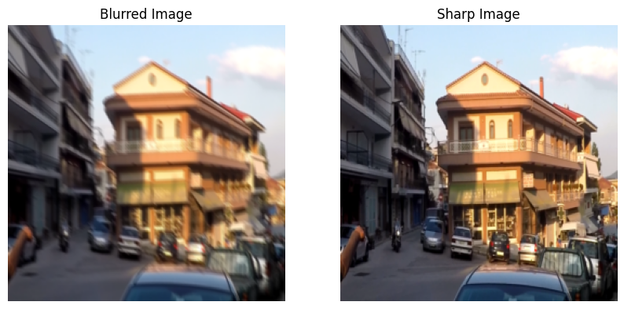

# **Deblurring and Super-Resolution using GANs on GoPro Large Dataset**


## 📌 **Overview**
This project implements a **Generative Adversarial Network (GAN)** for **image deblurring and super-resolution**. The model is trained on the **GoPro Large dataset**, which contains real-world motion-blurred images and their corresponding sharp images. The goal is to restore sharp images from blurry inputs and optionally enhance them using super-resolution.

---

## 📁 **Dataset**
### **GoPro Large Dataset**
The dataset consists of motion-blurred images captured using a GoPro camera, paired with their sharp ground truth images. It is commonly used for benchmarking deblurring models.  
🔗 **[Download Here](https://github.com/SeungjunNah/DeepDeblur_release)**  

- **Dataset Structure:**
  ```
  GOPRO_Large/
  ├── train/
  │   ├── blurred/
  │   ├── sharp/
  ├── test/
  │   ├── blurred/
  │   ├── sharp/
  ```

---

## 🏗 **Methods Used**
This project employs two key approaches:  

### **1️⃣ Deblurring Using GANs**
- The **DeblurGAN** architecture is based on a **U-Net generator** and a **PatchGAN discriminator**.
- The generator removes motion blur while retaining important image details.
- The discriminator helps the generator produce more realistic, sharp images.

### **2️⃣ Super-Resolution Using ESRGAN**
- After deblurring, the image can be **further enhanced** using **ESRGAN (Enhanced Super-Resolution GAN)**.
- ESRGAN improves fine details and enhances textures while upscaling images by **4× resolution**.

---

## 🎯 **Model Architecture**
### **1️⃣ Generator: UNet-based**
- **U-Net architecture** with **skip connections** is used for better feature retention.
- It consists of **downsampling** (encoder) layers that extract features and **upsampling** (decoder) layers that reconstruct the image.
- **Final layer** applies a **Tanh activation function** to normalize pixel values.

### **2️⃣ Discriminator: PatchGAN**
- The **PatchGAN discriminator** evaluates whether **local patches** of an image are real or fake.
- This enforces **structural consistency** in the deblurred image.
- It consists of **convolutional layers** with **LeakyReLU activations**.

### **3️⃣ Super-Resolution Model: ESRGAN**
- Uses **RRDB (Residual-in-Residual Dense Block)** to enhance texture details.
- The **adversarial loss and perceptual loss** ensure that the generated high-resolution images look realistic.

### **4️⃣ Loss Functions**
| Loss Function | Description |
|--------------|------------|
| **Adversarial Loss** | Binary Cross-Entropy (BCE) loss used to train the generator and discriminator. |
| **Reconstruction Loss** | L1 loss ensures pixel-wise similarity to ground truth images. |
| **Perceptual Loss** | VGG19 feature extraction loss enhances high-level details. |
| **Photometric Loss** | View synthesis loss for sharper output. |

---

## 📊 **Results and Evaluation**
### **Understanding the Metrics**
The model’s performance is evaluated using **three key metrics**:

1️⃣ **Mean Squared Error (MSE)**  
   - Measures the pixel-wise error between the generated image and ground truth.  
   - **Lower MSE** indicates **better quality**.

2️⃣ **Peak Signal-to-Noise Ratio (PSNR)**  
   - Measures the ratio of the maximum possible signal to the noise level.  
   - **Higher PSNR** values indicate **better image quality**.

3️⃣ **Structural Similarity Index (SSIM)**  
   - Measures the perceptual similarity between images based on luminance, contrast, and structure.  
   - **Higher SSIM** values (closer to 1) indicate **better image similarity**.

### **Test Set Evaluation Metrics**
| Metric | Value |
|--------|-------|
| **MSE** | 0.0082 |
| **PSNR** | 22.33 dB |
| **SSIM** | 0.8134 |

💡 **Interpretation:**  
- **PSNR of 22.33 dB** indicates the model effectively reduces blur but still has room for improvement.
- **SSIM of 0.8134** suggests good structural preservation but highlights minor distortions in fine details.

---

### **Single Image Evaluation (External Image)**
| Metric | Value |
|--------|-------|
| **MSE** | 0.0141 |
| **PSNR** | 18.50 dB |
| **SSIM** | 0.7117 |

💡 **Interpretation:**  
- **Lower SSIM and PSNR on external images** indicate the model generalizes well but may need fine-tuning for different motion blur patterns.

---

### **Deblurring vs Super-Resolution**
| Metric | Deblurred Image | Super-Resolved Image |
|--------|----------------|----------------------|
| **MSE** | 0.9505 | 0.0148 |
| **PSNR (dB)** | 0.22 | 18.30 |
| **SSIM** | -0.1121 | 0.7207 |

💡 **Interpretation:**  
- The **super-resolution step significantly improves sharpness**, as shown by the higher SSIM.
- **Deblurring alone doesn't guarantee fine detail restoration**, which is why the **combined pipeline (DeblurGAN + ESRGAN) performs best**.


---

## 📌 **Visualization**
### **Example Output**
| Blurred Image | Deblurred Image | Super-Resolved Image | Ground Truth |
|--------------|---------------|----------------------|--------------|
|  |  |  |  |

---

## 📜 **References**
- [DeepDeblur: Deep Multi-Scale CNN for Dynamic Scene Deblurring](https://openaccess.thecvf.com/content_cvpr_2017/html/Nah_Deep_Multi-Scale_CNN_CVPR_2017_paper.html)  
- [Official GoPro Large Dataset](https://github.com/SeungjunNah/DeepDeblur_release)  
- [ESRGAN: Enhanced Super-Resolution Generative Adversarial Networks](https://arxiv.org/abs/1809.00219)  

---

## 🔗 **Author**
📌 **Padmanabh Butala**  
📧 pb8176@rit.edu  
🔗 [GitHub](https://github.com/yourusername)

---
